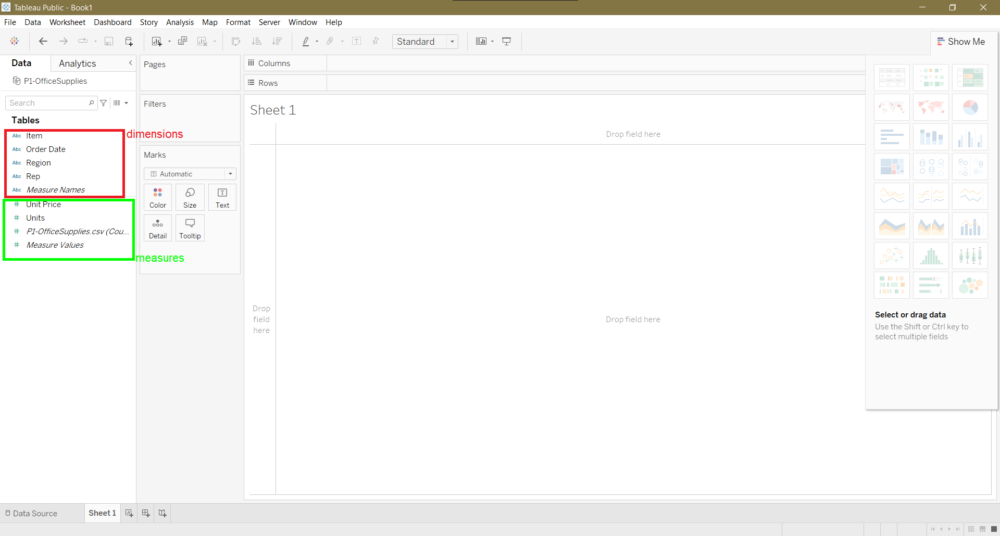
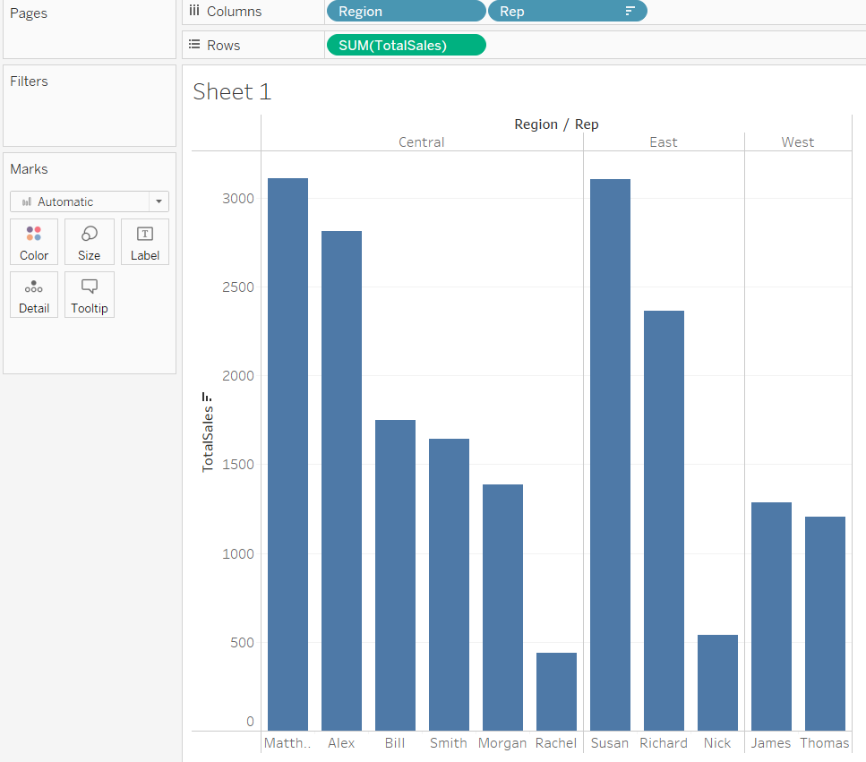
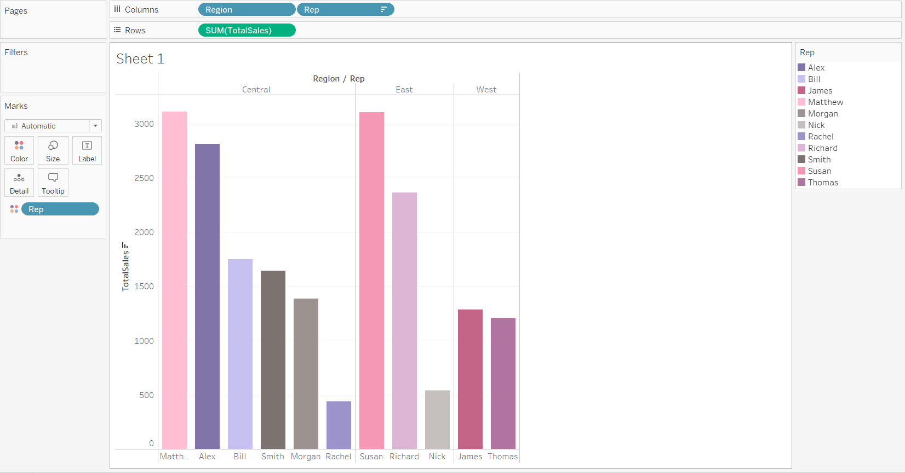
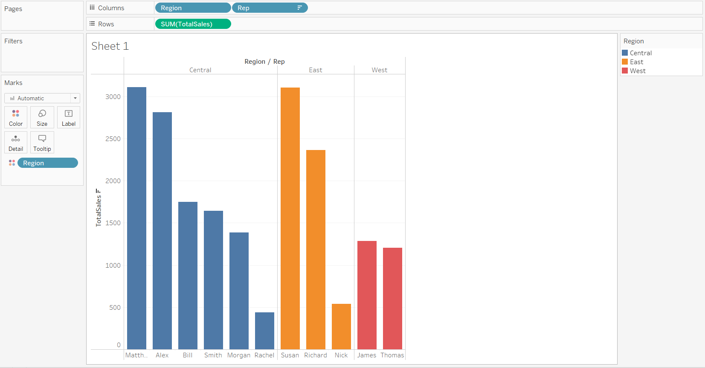
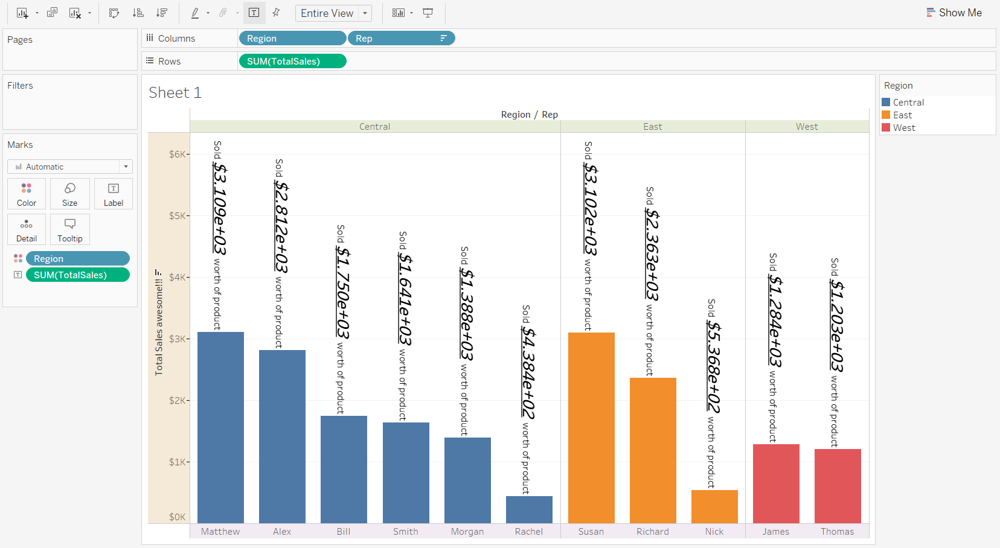

A CSV file is treated as a "text file" while connecting to a data source.

In the worksheet view, following section displays the data elements, which can be either **dimensions** (non-numerical stuff) or **measures** (numerical data columns).

**Dimensions** (blue color) are independent variables and **measures** (green color) are dependent variables.

A **dashboard** is a combination of **worksheets**.

A **story** is a combination of **worksheets**/**dashboards**.

You can create **calculated fields** for calculating no. of units sold x selling price of each unit.

Try remaking this:

Shortcut: Hold down `Ctrl` and drag the **measure**/**dimensions** from **Columns** or **Rows** ribbon to create a duplicate of that **measure**/**dimension**.

Try to color the above worksheet as follows, and explore around:

Try playing around with **Labels** and **Format** to achieve the following result:

Tableau workbook `.twb` or `.twbk`

Kirill's Tableau [profile](https://public.tableau.com/app/profile/kirill.eremenko/vizzes).