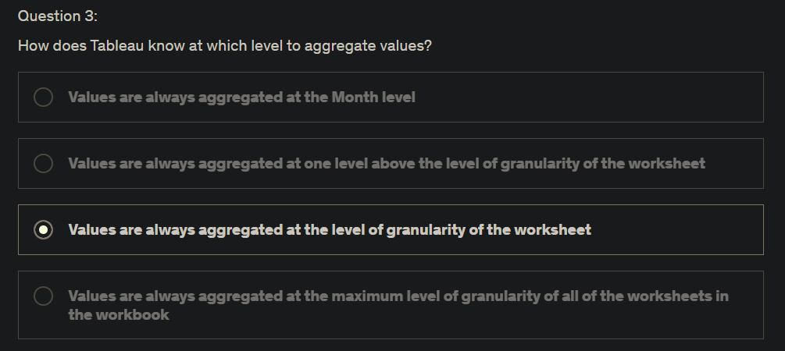
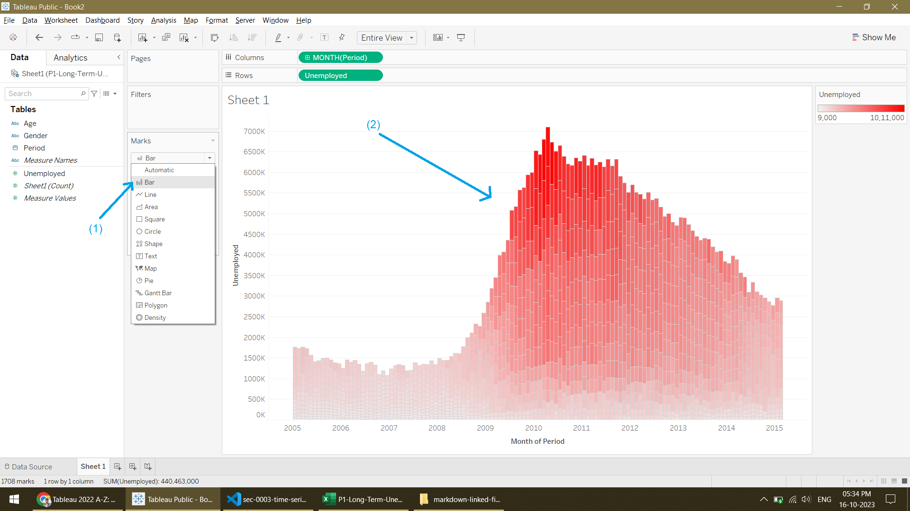
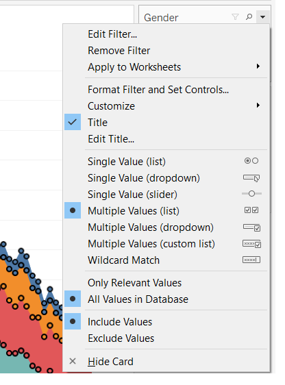

Download the [dataset](https://www.superdatascience.com/pages/tableau) for Section 3.

[Difference](https://www.tableau.com/blog/tableau-cloud-tips-extracts-live-connections-cloud-data) between **Live** connections and **Extracts** in Tableau.

Key points from above link:

||Extracts|Live connections|
|-|-|-|
|Meaning|Snapshots of data loaded into system memory|Realtime connection to the **Data Source**|
|Advantages|Optimized for aggregation and quick recall, faster than **live connections** even in complex vizzes with large data sets with filters, calculations, etc.|Convenience of realtime updates|
|Disadvantages|Need to be refreshed to receive updates from the orig **Data Source**, |Data queries are only as fast as the DB itself; other factors affecting speed of Tableau workbook: network speed, traffic, custom SQL|

Found this somwhere on the internet:

> Tableau Public only supports **extract**ed data sources, and does not support live connections to data. However, authors have the option to allow Tableau Public to automatically refresh data sources connecting to Google Sheets every 24 hours. For all other data sources (for example, Excel or a CSV), automatic refresh on Tableau Public is not supported. For more information, see [How is data from Google Sheets refreshed on Tableau Public?](https://community.tableau.com/s/tableau-public-faq#:~:text=Tableau%20Public%20only%20supports%20extracted,Google%20Sheets%20every%2024%20hours.)

That's why, the Tableau Public Desktop app that I downloaded does NOT have the following radio buttons in the **Data Source** tab:

However, in the full version, if you choose to **Extract** a data source, you need to save the **Extract file** somewhere, which has an extension of `.tde` (old) or `.hyper` (2017 onwards).

More on all file types and their extensions used by Tableau [here](https://help.tableau.com/current/pro/desktop/en-us/environ_filesandfolders.htm) and [here](https://mindmajix.com/tableau-file-types-and-extensions).

A random screenshot just for your info:

# Time series visualization

Tableau automatically adds each field to the view. That is, each *double-click* results in an additional field added to a shelf in an intelligent way. Like Show Me, this function leverages Tableau's ability to make an intelligent “best guess” of how the data should be displayed.

👆

Red changes the categories of observations.

Green changes the number of dots (granularity) in the visual.

Trick (not universally correct): Think of **Columns** ribbon as X-axis and **Rows** ribbon as Y-axis.

# Aggregation, granularity and level of detail

Tableau will always aggregate measures at the level of granularity of your worksheet.

Just like i demonstrated in the above screenshots, **measures** (Y-axis) get **aggregated** and **dimensions** (X-axis) determine the **granularity** in Tableau. (this is not a very accurate/precise definition, it's kaam chalau. Hard to put in words, you gotta mess around a lot in Tableau to understand wtf is happening.)

You can switch off aggregation:

You can increase granularity in different ways, without disabling "**Aggregate Measures**"

👆 122 marks

👆 244 marks

👆 1708 marks (granularity level = gender + age)

Changing the aggregate function:

Another way of changing granularity:

👆 Here, again, granularity level = gender + age

**Highlighting** in Tableau is same as **Slicers** in Excel. ***\[WRONG! ✖❌✖❌\]*** **Filtering** in Tableau is same as **Slicers** in Excel.

Final product:

# Quick filters:

Changing the type of "quick filter":

