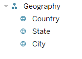
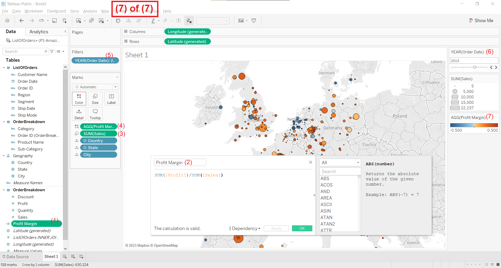
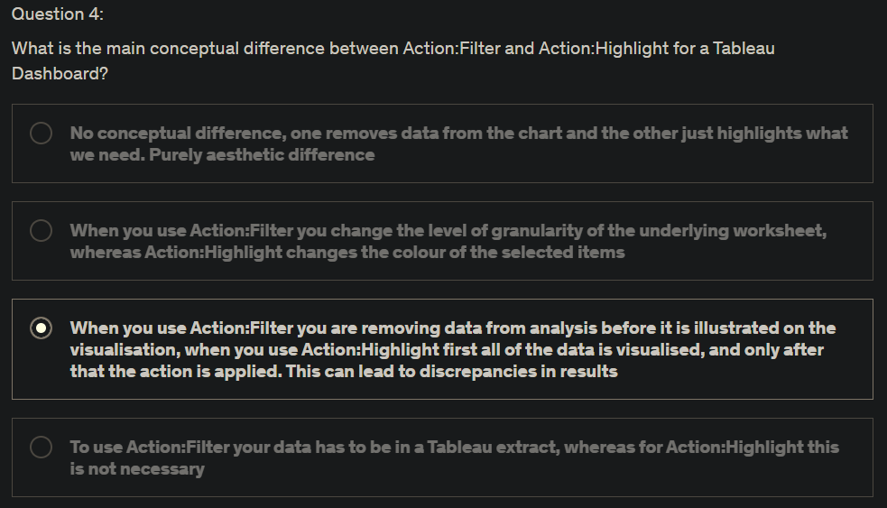

# Joining data in Tableau

We will cover **relationships** in a later section, for now, **join** the `ListOfOrders` and `OrderBreakdown` tables using the physical layer in the **Data Source** tab in Tableau, immediately after connecting to `P1-AmazingMartEU2.xlsx` as data source.

Double click a **logical table** to see it's **physical tables** as components. Now drag and drop tables to create joins:

# Creating a map, working with hierarchies

Tableau already created a hierarchy for us, but let's delete that:

Drag and drop upon parent to create a hierarchy:

Drag this heirachy onto the worksheet and let Show Me create a map. Notice the plus sign on the Country dimension, click on it to increase the granularity according to hierarchy:

Final product:

# Creating a scatterplot, applying filters to multiple worksheets

#### (i.e., the same filter should apply changes to all worksheets)

Final scatter plot in the 2nd worksheet:

# Creating your first dashboard

Final output:

# Interactive Action: Filter

2 main types of actions in Tableau: filtering and highlighting

Use as filter:

You can create your own Actions by going to **Dashboard** > **Actions**.

imo, **Use as Filter** is pretty fast and useful, you might not need creating your own Actions.

You can click on multiple circles on the map by holding down Ctrl, or by selecting the **Rectangular Selection** button from the **Show/Hide View Toolbar**.

---

### Filter vs Highlight

**Highlight** keeps other marks, but greys them out.

**Filter** removes all other marks, and only keeps the ones that match the filtering criteria. (All sizes, coloring, details, etc. now becomes in relation to the filtered data, and not relative to the whole dataset. You may see changes in size and color immediately, such that info *relative* (⭐) to the data after filtering is presented.)

Finer things in life:

---

# Interactive Action: Highlighting

Even after adding an Highlighting action onto the map, you will see that there is no highlighting.

Solution:

Now highlighting actions will work:

More control btw:

