# What format your data should be in

Machines do not like the following format:

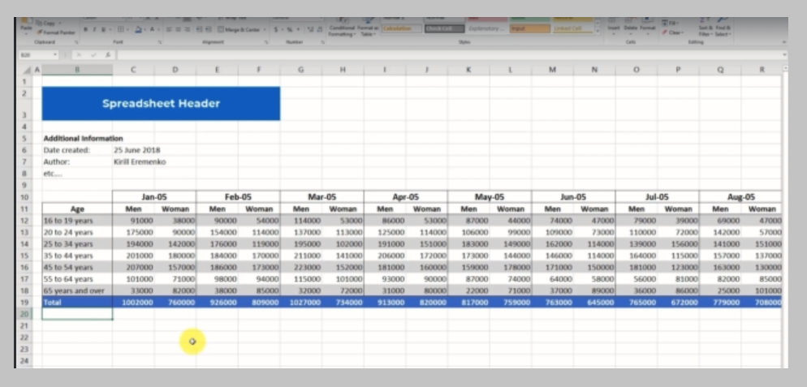

Neither this:

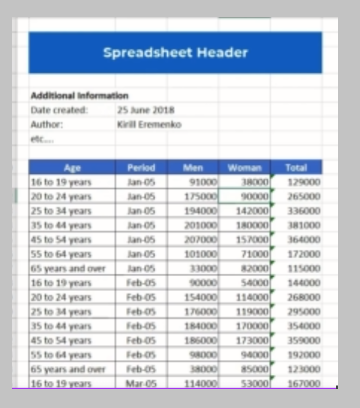

Machines will prefer this:

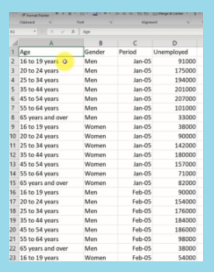

👆 More columns, the better. Machines do not like pivoted/aggregated\* data. Also, notice that there is no formatting/headers/coloring in a machine-friendly dataset. Also, no `Total` values or other aggregate values.

Gaps like the below image are good for humans, but not for machines:

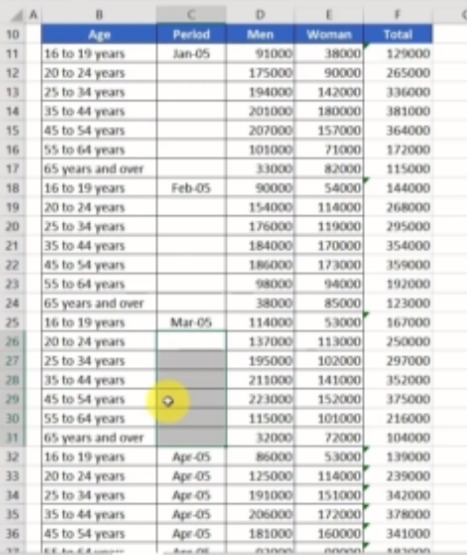

Tableau has some provisions for data preparation for such kind of datasets.

# Data Interpreter

Download `PersonalVehicleSalesGlobal.xlsx` from Kirill's website.

The Excel file is very messy. You might have to do some key cleaning before importing the file to Tableau.

After cleaning, import it as a Data Source and then:

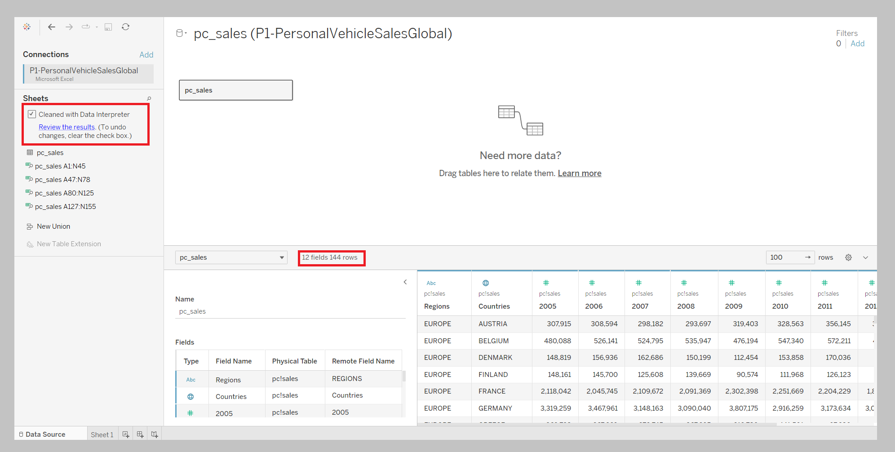

# Pivot

Our data is still not machine-optimized as there are seperate columns or years.

Use `Pivot` to do this:

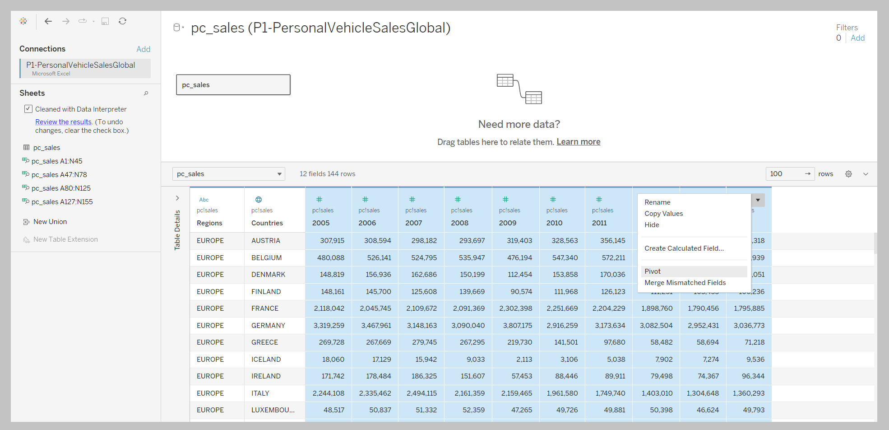

Outcome:

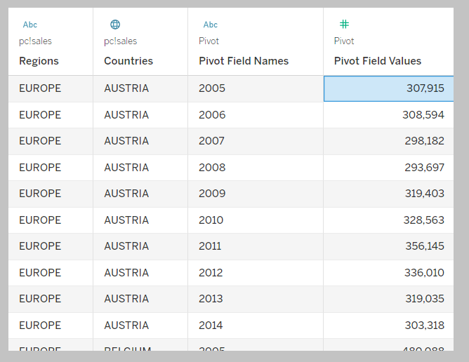

[This](./markdown-linked-files/sec-0007-0022.pdf) is what ChatGPT had to say about the pivoting functionality in Tableau.

# Splitting a column into different columns

Example: extracting the last word from each row of the `Regions` column.

Example: you might want to split the first ame and the last name from the full name from a dataset in the future. This is why you Split.

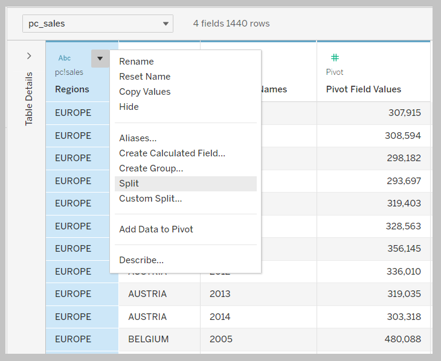

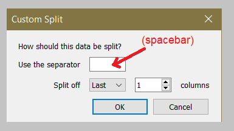

Outcome (a section of it):

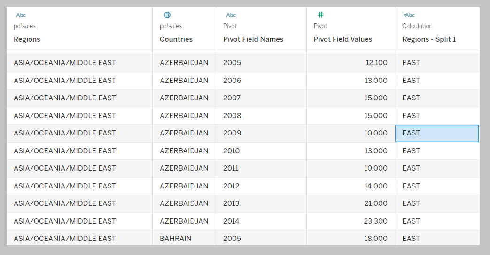

Alternatively, you may split from the Worksheet:

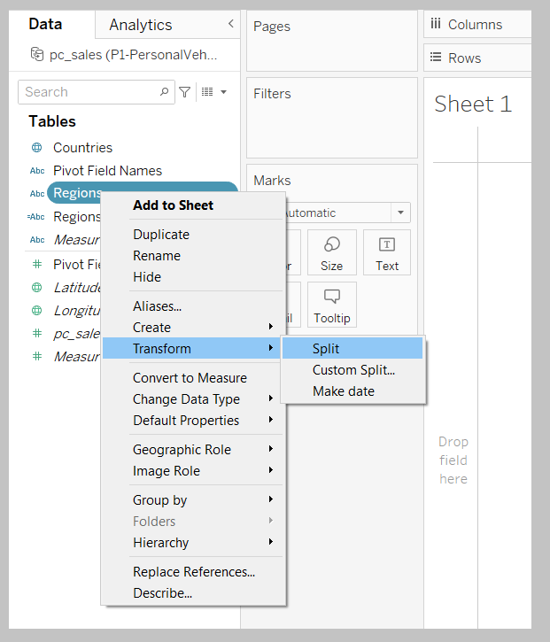

# Metadata grid

Rename columns, and delete the last column:

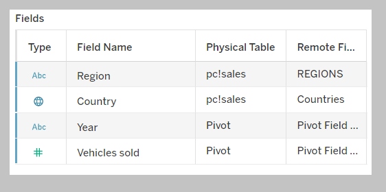

Build this:

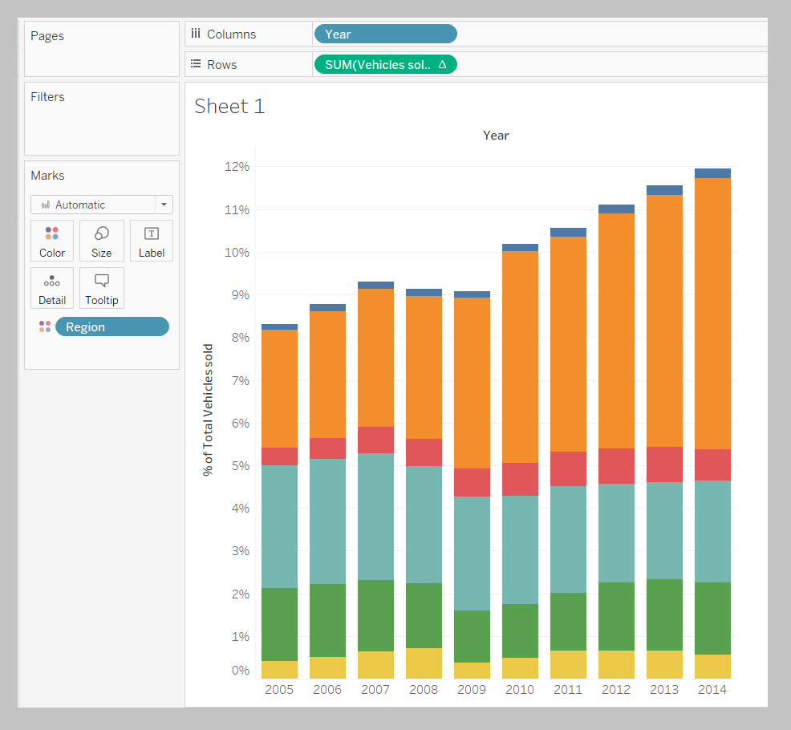

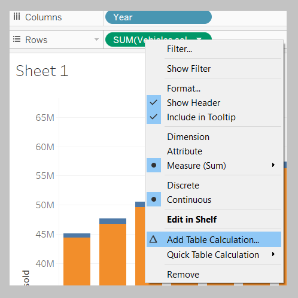

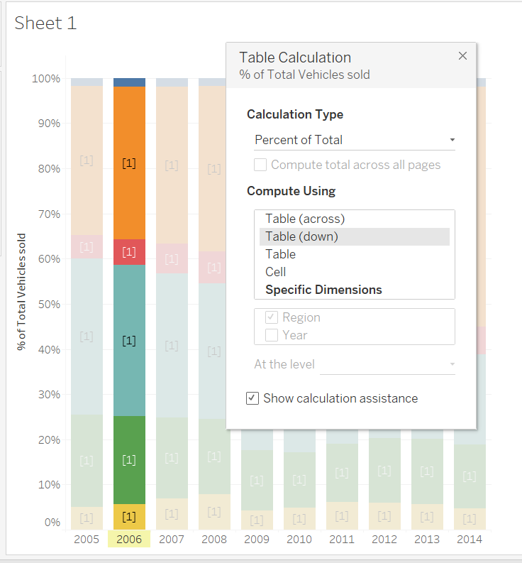

Final state of worksheet:

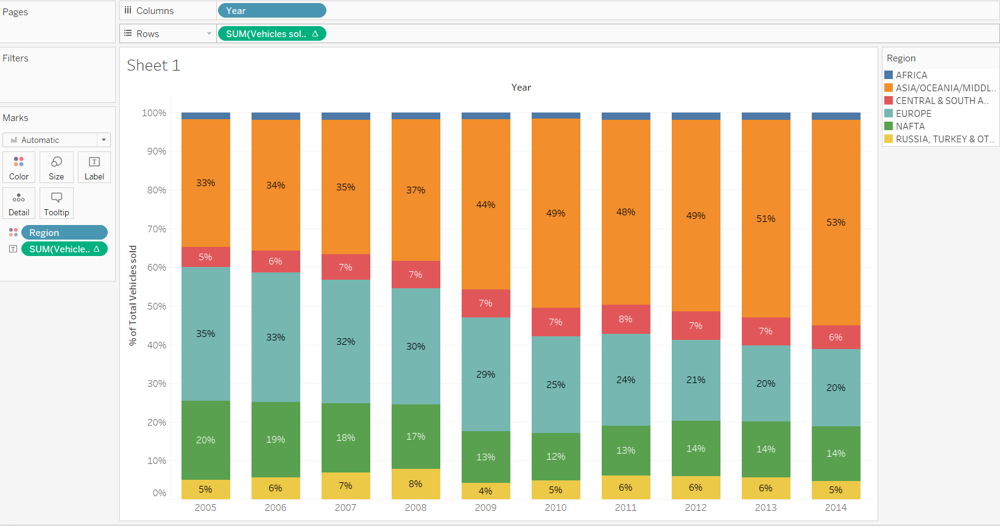

# Fixing geographical data errors

Create the following map:

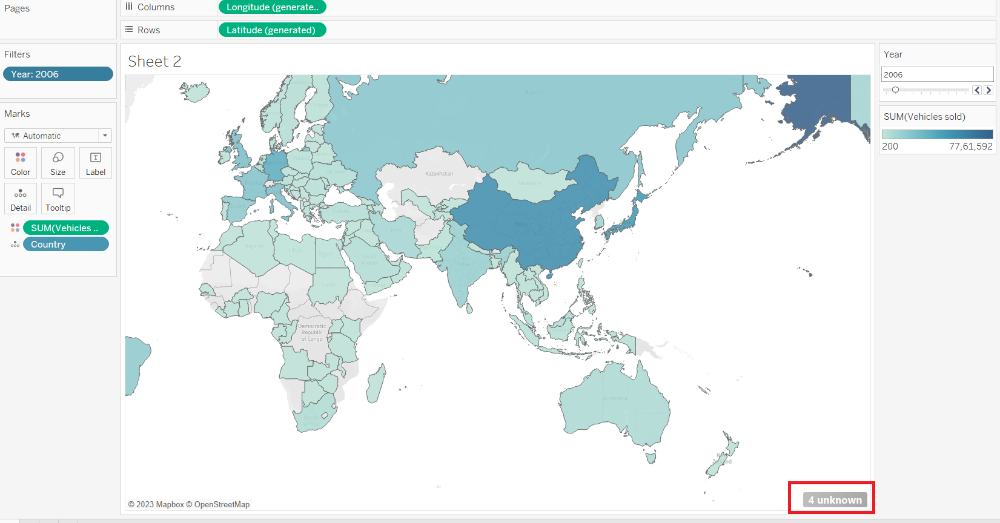

There are errors due to spelling mistakes:

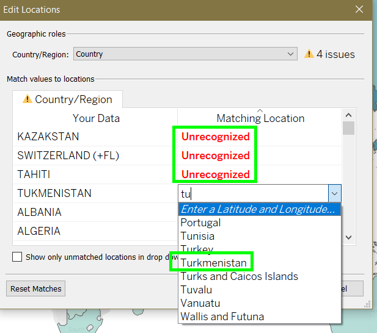

Fix them and click OK.

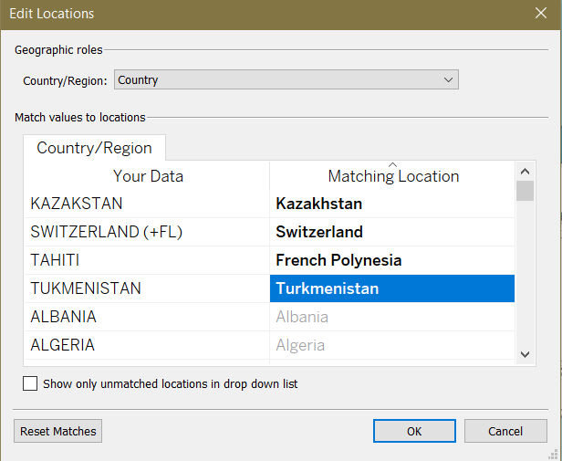

---

A data scientist's 70% time is spent on data preparation (even before analysis).

---

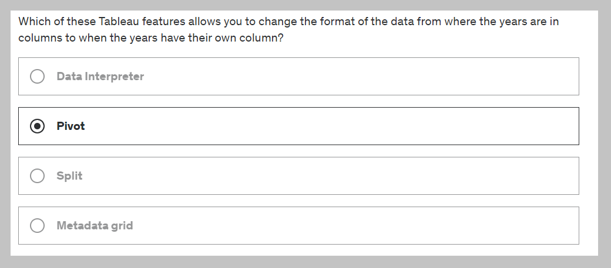

