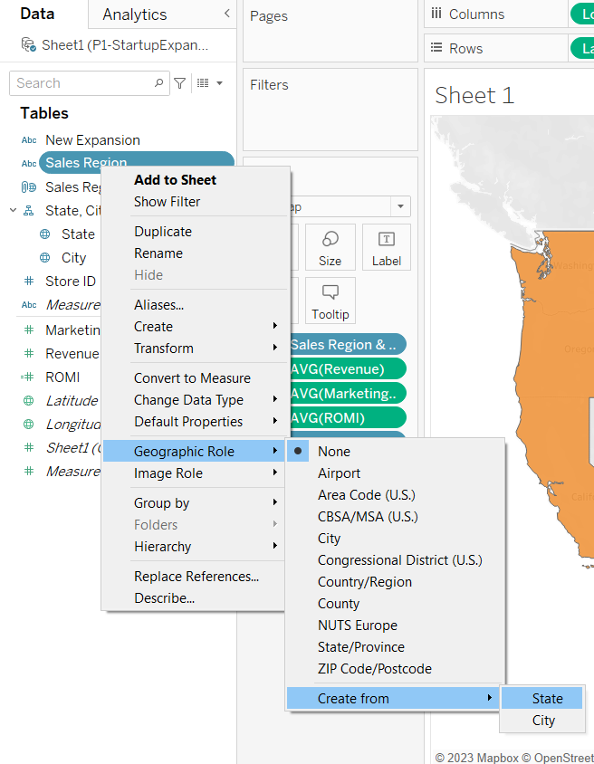
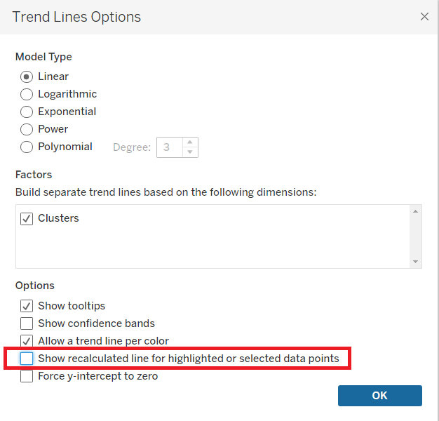
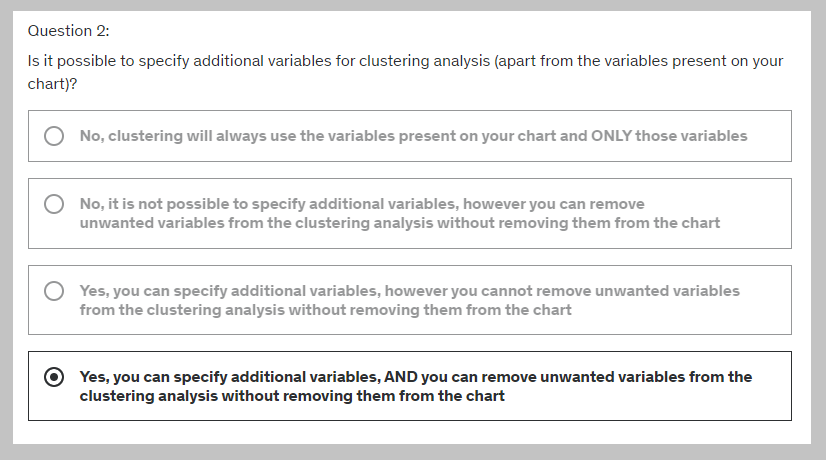

# Startup Expansion analytics

---

### Problem statement

You are a data scientist working for a laundry pickup services startup WeWashUSleep. This is a relatively small company and they cannot compete with the big players in major cities. The company's strategy is to build a vast network in the smaller cities.

WeWashUSleep already had a strong presence in 140 locations and recently opened new stores in 10 cities. Additionally, the company has 2 separate sales regions.

You have been assigned the following analytics tasks:

**Task 1:**

Identify which of the 2 sales regions is performing better (i.e. outperforms the other in 2 of the following 3 metrics):

* Average revenue per city

* Average marketing spend per city (tip: less is better)

* Average ROMI (Return on Marketing Investment) per city (revenue/marketing spend)

**Task 2**

Identify which of the 10 new locations have the best potential for the company to invest more funds into marketing.

---

# Custom territories using Groups

Download `StartupExpansion.xlsx` and `US-Cities-Population.csv`

Intuitive for first metric:

However, the above approach is not correct. Above, we find the average revenue per city, for each state.

We want to treat the whole orange area as a single region and the whole blue area as a single region, and then find average revenue per city for each region.

This is how you create a **custom territory**: (Don't delete what you've done so far)

Hold ctrl and highlight all the orange states.

Right click on any orange state:

Now just take the `State` dimensions out of **Marks**:

You may recolor the **custom territories**.

Final state of worksheet:

# Custom territories using Geographic Roles

👆 Associates each value in the `Sales Region` column (which does NOT have a geographical role), with the corresponding value in the `State` column (which has a geographical role).

The `Sales Region` dimension gets moved to the **hierarchy** (which, by the way, was automatically created when you loaded the dataset):

Now, create a new sheet and simply drag the `Sales Region` dimension (from under the **hierarchy**) onto the worksheet, and voila: the 2 regions will be marked as dots on the map. Done.

After some processing:

Some more prcessing:

And the metrics are the same as what we got by creating custom territories using Groups.

Prefer the **geographical role** method over the **groups** method.

# Adding a highlighter

Create a new sheet. Drag `City` onto it.

This is NOT a good way to visualize cities because the cities are ambiguous:

The correct way: First drag `State` onto the worksheet. And then expand the hierarchy by clicking the + icon inside the `State` dimension:

Do some processing to obtain this:

What if you want the **Color** of the circles to be in proportion to `SUM(Revenue)`, while not losing the ability to differentiate between `New` and `Old` cities?

Remove `New Expansion` from **Color** and put it upon **Detail**.

Do the following:

And then put `SUM(Revenue)` onto **Color**.

Do some processing. Final state of worksheet:

# Clustering

Create the following visualization on a new sheet:

It is intuitive that the upper cluster gives better revenue on investments in markeing, which the lower cluster doesn't give much.

From the **Analytics**  tab, drag `Cluster` onto the worksheet to cluster the points:

Do some processing to get this final state:

We will learn to fine-tune the clusters in a bit.

# Cross-database joins

The population of a city plays a key role in cluster analysis (since this company's revenue directly depends on the number of customers). If a city has a huge population, it means there is lot of scope to earn money (`Revenue`), simply because there's going to be a lot more dirty clothes because there's a lot more people.

You can ask a question: What if the lower cluster is not showing increased `Revenue` with increasing marketing investment because it's maxed out on the amount of `Revenue` it can earn for the respective population?

Maybe the population of the cities in the lower clusters is just small, and maybe that's why the Revenue is stagnant even when investments in marketing are increased.

To check wtf is happening, we will bring in an external dataset: `US-Cities-Population.csv`.

Import it as a new **data connection** (NOT as a new **data *source***, i'm guessing they are different. See the **Add** button in the screenshot below ⚠⚠⚠)

We *could* use **blends**/**relationships**, but there's some news:

> You can now ***join*** **physical tables** from *heterogenous* **data sources**. This was not possible in earlier versions of Tableau. Since a **join** will result in a cumbersome table, make sure to **Hide** useless columns after **join**ing.

> Since we want to use a **join** instead of **blend**/**relationship**, make sure to **join** on the `City` as well as the `State` columns. ⚠⚠

👆 Hide some rows if you want. (make it `11 fields 150 rows`)

⚠⚠⚠ By the way, this new table that we just imported, does *NOT* appear as a different **Data Source**, which is weird, so be careful:

# Modeling with clusters

Hide unnecessary columns (belonging to the newly imported table) from the joined table.

Rename `2015 Estimate` to `Population`.

**Clusters** > **Edit clusters**.

Drag the `Population` **measure** into the window:

Output:

Drag **Trend Line** from **Analytics** tab onto the sheet. You'll get 3 trendlines, one for each cluster.

Right click a trend line > **Edit All Trend Lines** > uncheck **Show Recalculated Line for Highlighted or selected data points**:

Now, **highlight** only the newly expanded cities from the highlighter on the right:

The line with the max slope is orange, so the orange circles represent those newly-opened stores, which should be getting more future investment in marketing.

Which answers the 2nd question in the analytics problem that we are solving.

So final answers (i.e., Store IDs) = 143, 146, 148, 150

# Saving your clusters

i.e. how to use the clusters you created into other sheets?

Just drag the `Clusters` into the Data tab, and it gets saved as a **dimension** (more precisely, as a **group**).

Rename that **group** as `Our Clusters`.

Create a new sheet and find the average population per cluster as follows:

Another example of re-using clusters:

# New mobile features

You're already familiar with this when you messed around in Tableau with dashboards:

# Section Recap

* How to create **custom territories** via **groups**

* How to create **custom territories** via **geographic roles**

* **Highlighters** in Tableau (different from **filters**)

* Using domain knowledge && external datasets - **cross database joins**

* How to perform clustering analysis *without* using external R scripts

* How to combine regression modelling with clustering

* How to save clusters fo further analytics

