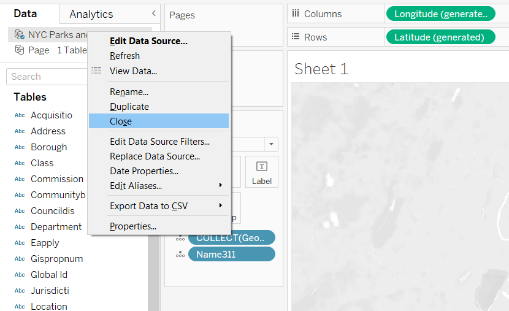
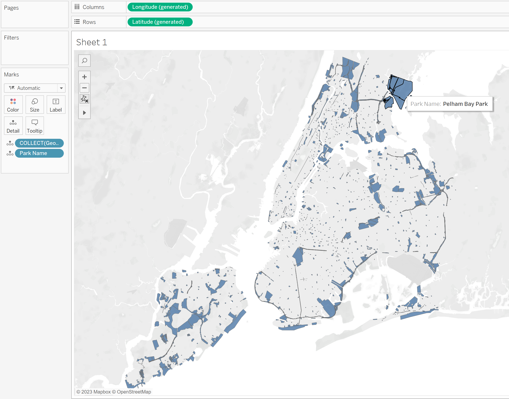
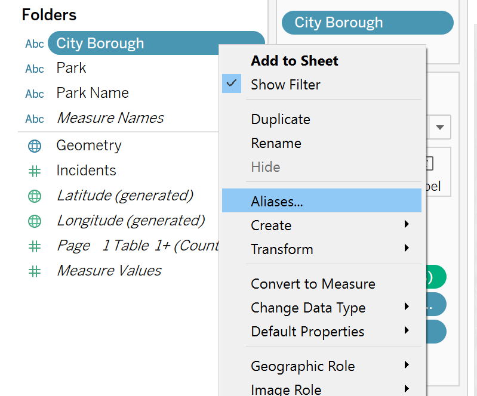

### Problem statement


Ensure proper use of tooltip and filtering per borough.

Download the PDF file and zip file from the website.

# Conncting to PDF

`Page 1 Table 2` is an incomplete version of `Page 1 Table 1`. Ignore the former. Work with the latter.

Import `Table 2`'s for all `Page`s in the following fashion:


Make sure to **Drag Table to Union** so that you don't accidentally create a **join** instead of a **union**.

Now do this:


Which results in this:


Rename and hide some columns to get the following:


How to verify if the data has come through correctly? The PDF says that the total incidents is = 109. But if you drag `Total Incidents` measure onto the worksheet, you will get 218, which is wrong.

This has happened because Tableau has considered the `Total` record from the PDF as a data record while importing:


Just add a **filter** rom the top right corner of the **Data Source** tab and remove off this record:


# Connecting to spatial files

4 different ways of representing spatial data supported by Tableau:


We will be dealing with shapefiles.


Now connect to the spatial file as a new **data source**.

For us, the `Name311`, the `Borough` and the `Geometry` fields are important.

Do the following:


# Joining to spatial files

We will combine the PDF and spatial data and also take care of data integrity and data correctness.

Delete the previous sheet. Close the connection to the spatial file.

---

### Quick clarification 🥰

I sense that I am getting confused between the terms **Data Source** and **Connection**.

A **Data Source** is a (group of) file(s). A **Data Source** can have multiple **Connections** attached to it in the form of files of the same **Data Source**, or in the form of tables joined to the tables of the initial files in the **Data Source**.

A **Data Source** can be **Close**d, while a **Connection** can only be **Remove**d.

A **Data Source** shows up on the Data/Analytics sidebar in the worksheet view of Tableau. While a **connection** is *a part* of the **Data Source**, and hence, it is *NOT* explicitly shown on that sidebar.

---

Rename the PDF connection to `New York Crime Stats with Geometry`:



Add the spatial file, this time not as a **Data Source**, but inside the existing **Data Source** as a **Connection** (make sure to go to the **physical layer** of the big unionised table before adding a new connection ⚠⚠⚠ only then you will be able to ***join*** the newly imported spatial table.):


However, 5 records from the PDF table were dropped because of the join. How did I know this? Look:


Let's check if there are any duplicate values of  in the joined table because duplicate values can make up for those values which were dropped due to the **join** process.

To see the number of occurrences of each `Park` name, do the following:


`1` means that the `Park` name occurred only once. Let's sort it by descending order of occurence:


Outcome:


Other tips:

* Apply **Filter** from worksheet view to see only those records which do not have `Incidents` = `0` && have repeated `Park` names in the joined table. Such records need to fk off.

* Change the **join** type to **left join** from the **physical layer** of our table from the **Data Sources** tab, and then look for records with NULL values for the column `Name311`. These records should also fk off.

* Change back to inner join and then use **Filters** from the **Data Source** tab and exclude the records that you want to fk off from our dataset.

* You may also choose to save these fked offed `Park` names in a separate Excel file to discuss with the stakeholder about what is to be done with them. For now, we will exclude them from our analysis.

* GG.

👆 Watch the video `73. Joining to Spatial Files` if you don't remember the exact steps for data cleaning for this Section of this Udemy course. It's kinda confusing, I agree.

Following is the final state of the prepared data (after renaming and hiding some columns):


Like I said, you might need to rewatch the video, there are too many small steps.

Outcome *after* cleaning data:



# Putting it all together (visualizing the data)

Do the following:


You *could* do this (don't do it): **Map** menu > **Background Layers** > check **County Borders** checkbox.




Final outcome:


# Step and Jump line chart

Challenge 2:


Download dataset for challenge 2 from website.

We will be ignoring the `Establishment`, `Average Employment` and `Total Wage` fields from the dataset as they are not reelevant.

There is a hierarchy in the NAICS numbering system. The left most digit's place value and face value determine its group.

Import the dataset as a text file.

Add a **Data Source Filter**: we want only `County`.

Rename `Area` field to `County`, and change it's datatype:


Rename `NAICS Title` field to `Industry`.

Change the datatype of the field `Naics` to **String** (since we do not want to order the NAICS numbers by magnitude of the numerical value, but as a group of industries.)

Create a calculated field called `Level` as:

```
LEN([Naics])
```

Add another **Data Source Filter** on `Level` field such that only those records having `Level` = `2` remain.

Hide the `Establishment`, `Average Employment` and `Total Wage` fields.

State of worksheet:


Go to worksheet. Drag `Year` **dimension** into **Columns ribbon** and `Annual Average Salary` **measure** into **Rows ribbon**. Change the aggregate function from `SUM()` to `AVG()`.


Change **Line Type** to **Step**.

Rename the worksheet as `Step Line Chart`.

# Viz in Tooltip

Create a new worksheet called `Annual Average Salary Map`.

Drag the `County` **dimension** onto the sheet.

Click on `62 unknowns` > **Edit Locations**:


Change **Marks** to `Map`.

Drag `Annual Average Salary` onto **Color** inside the **Marks** card, and then set the aggregate function from `SUM()` to `AVG()`.

Change border color to white and opacity to 65%. Change the color gradient of `AVG(Annual Average Salary)` to green.

**Map** menu > **Background Layers** > check `County Names`.

---

Create new worksheet called `Top 5 industries`.

Do the following:


Now drag the dimension `Industry` onto the **Filters** card such that we get only the top 5 industries:


State of worksheet:


Go to worksheet `Average Annual Salary Map`.


Customize as you want.

---

The course is complete!